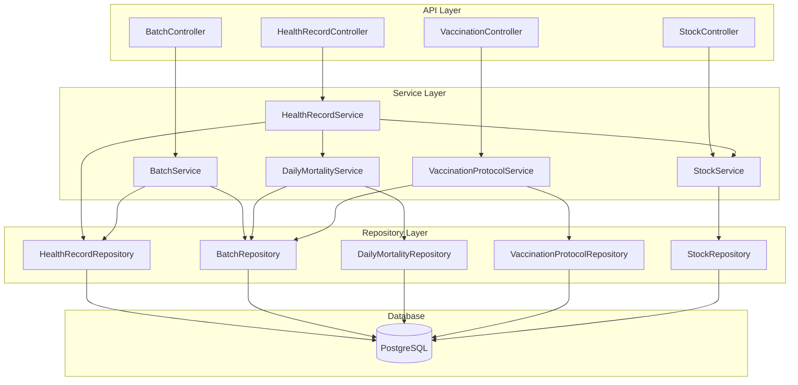

# Design Document: Sanitary & Security Shield

## Overview

The Sanitary & Security Shield feature implements critical health and safety compliance controls for poultry farming operations. This design addresses four key areas:

1. **Withdrawal Period Enforcement**: Prevents sale of batches during antibiotic withdrawal periods to comply with drug residue regulations
2. **Mortality Synchronization**: Automatically updates batch inventory when veterinarians record deaths, preventing data inconsistencies
3. **Pharmacy Integration**: Links veterinary treatments to pharmacy inventory for automatic stock deduction and cost calculation
4. **Vaccination Compliance**: Manages strain-specific vaccination schedules and generates alerts for due/overdue vaccinations

The design extends existing services (BatchService, HealthRecordService, DailyMortalityService) and introduces new components (VaccinationProtocolService, StockService) while maintaining the current Spring Boot architecture patterns.

## Architecture

### System Components



### Component Responsibilities

**HealthRecordService** (Extended):
- Validates withdrawal period data on health record creation
- Triggers mortality synchronization when mortalityCount > 0
- Validates stock availability before recording treatments
- Deducts medication quantities on approval
- Calculates treatment costs from stock unit prices

**BatchService** (Extended):
- Implements `isBatchSellable()` method to check withdrawal periods
- Validates batch status transitions against active withdrawal periods
- Returns detailed error messages with withdrawal expiration dates

**DailyMortalityService** (Extended):
- Implements `decrementStock()` method using atomic SQL UPDATE
- Creates mortality records with source attribution (WORKER_REPORT vs VETERINARIAN_EXAMINATION)
- Prevents double-counting through source tracking

**VaccinationProtocolService** (New):
- Manages vaccination schedules for chicken strains
- Calculates vaccination due dates based on batch arrival date
- Generates alerts for due/overdue vaccinations
- Uses SQL View or caching for performance optimization
- Marks vaccinations as completed when corresponding health records exist

**StockService** (New):
- Manages pharmacy inventory (vaccines and medications)
- Provides stock availability checks
- Handles atomic stock deductions
- Maintains unit price history for cost calculations

### Data Flow Patterns

**Withdrawal Period Enforcement Flow**:
```
Admin requests batch status change to SOLD
  → BatchService.updateStatus()
  → BatchService.isBatchSellable()
  → Query HealthRecords for active withdrawal periods
  → If active period exists: reject with expiration date
  → If no active period: allow status change
```

**Mortality Synchronization Flow**:
```
Veterinarian creates HealthRecord with mortalityCount > 0
  → HealthRecordService.create()
  → DailyMortalityService.decrementStock()
  → Atomic SQL: UPDATE batches SET current_count = current_count - :count
  → Create DailyMortalityRecord with source = VETERINARIAN_EXAMINATION
```

**Treatment Stock Integration Flow**:
```
Veterinarian creates HealthRecord with medication
  → HealthRecordService.create()
  → StockService.checkAvailability()
  → If insufficient: reject with error
  → If sufficient: create pending HealthRecord
  → Admin approves HealthRecord
  → StockService.deductQuantity()
  → Calculate cost: unitPrice * quantityUsed
```

**Vaccination Alert Flow**:
```
Veterinarian requests dashboard
  → VaccinationProtocolService.getAlertsForToday()
  → Query SQL View or Cache for due vaccinations
  → Filter out completed vaccinations (check HealthRecords)
  → Return alerts with batch, vaccine, due date
```

## Components and Interfaces

### Entity Model Extensions

**HealthRecord** (Extended):
```java
@Entity
@Table(name = "health_records")
public class HealthRecord {
    // Existing fields...
    
    @Column(name = "withdrawal_days")
    private Integer withdrawalDays;
    
    @Column(name = "is_vaccination", nullable = false)
    @Builder.Default
    private Boolean isVaccination = false;
    
    @ManyToOne(fetch = FetchType.LAZY)
    @JoinColumn(name = "stock_item_id")
    private StockItem stockItem;
    
    @Column(name = "quantity_used", precision = 12, scale = 4)
    private BigDecimal quantityUsed;
    
    // Calculated field for withdrawal expiration
    public LocalDate getWithdrawalExpirationDate() {
        if (withdrawalDays == null || withdrawalDays == 0) {
            return null;
        }
        return examinationDate.plusDays(withdrawalDays);
    }
    
    public boolean hasActiveWithdrawalPeriod() {
        if (Boolean.TRUE.equals(isVaccination)) {
            return false;
        }
        LocalDate expiration = getWithdrawalExpirationDate();
        return expiration != null && LocalDate.now().isBefore(expiration);
    }
}
```

**DailyMortalityRecord** (Extended):
```java
@Entity
@Table(name = "daily_mortality_records")
public class DailyMortalityRecord {
    // Existing fields...
    
    @Enumerated(EnumType.STRING)
    @Column(name = "source", nullable = false, length = 30)
    @Builder.Default
    private MortalitySource source = MortalitySource.WORKER_REPORT;
    
    @ManyToOne(fetch = FetchType.LAZY)
    @JoinColumn(name = "health_record_id")
    private HealthRecord healthRecord;
}

public enum MortalitySource {
    WORKER_REPORT,
    VETERINARIAN_EXAMINATION
}
```

**Batch** (Extended):
```java
@Entity
@Table(name = "batches")
public class Batch {
    // Existing fields...
    
    @Column(name = "current_count")
    private Integer currentCount;
    
    // Initialize currentCount = chickenCount on creation
    @PrePersist
    public void initializeCurrentCount() {
        if (currentCount == null) {
            currentCount = chickenCount;
        }
    }
}
```

**StockItem** (Extended):
```java
@Entity
@Table(name = "stock_items")
public class StockItem {
    // Existing fields...
    
    @Enumerated(EnumType.STRING)
    @Column(name = "stock_type", nullable = false, length = 20)
    private StockType stockType;
    
    @Column(name = "unit_price", precision = 12, scale = 4)
    private BigDecimal unitPrice;
}

public enum StockType {
    VACCINE,
    MEDICATION,
    FEED,
    EQUIPMENT
}
```

### New Entity: VaccinationProtocol

```java
@Entity
@Table(name = "vaccination_protocols", 
       indexes = {
           @Index(name = "idx_vac_protocol_strain", columnList = "strain"),
           @Index(name = "idx_vac_protocol_day", columnList = "day_of_life")
       },
       uniqueConstraints = @UniqueConstraint(
           name = "uq_vac_protocol_strain_vaccine_day",
           columnNames = {"strain", "vaccine_name", "day_of_life"}
       ))
@EntityListeners(AuditingEntityListener.class)
@Getter
@Setter
@Builder
@NoArgsConstructor
@AllArgsConstructor
public class VaccinationProtocol {
    
    @Id
    @GeneratedValue(strategy = GenerationType.IDENTITY)
    private Long id;
    
    @Column(nullable = false, length = 100)
    private String strain;
    
    @Column(name = "vaccine_name", nullable = false, length = 200)
    private String vaccineName;
    
    @Column(name = "day_of_life", nullable = false)
    private Integer dayOfLife;
    
    @Column(columnDefinition = "TEXT")
    private String notes;
    
    @ManyToOne(fetch = FetchType.LAZY)
    @JoinColumn(name = "created_by_id")
    private User createdBy;
    
    @CreatedDate
    @Column(name = "created_at", nullable = false, updatable = false)
    private LocalDateTime createdAt;
    
    @LastModifiedDate
    @Column(name = "updated_at", nullable = false)
    private LocalDateTime updatedAt;
}
```

### Service Interfaces

**BatchService Extensions**:
```java
public interface BatchSellabilityValidator {
    boolean isBatchSellable(Long batchId);
    Optional<LocalDate> getWithdrawalExpirationDate(Long batchId);
    void validateStatusTransition(Long batchId, BatchStatus newStatus) 
        throws WithdrawalPeriodActiveException;
}
```

**DailyMortalityService Extensions**:
```java
public interface MortalitySynchronizer {
    void decrementStock(Long batchId, Integer mortalityCount, 
                       LocalDate recordDate, Long healthRecordId);
    List<DailyMortalityRecord> findBySource(MortalitySource source, 
                                           LocalDate start, LocalDate end);
}
```

**VaccinationProtocolService**:
```java
public interface VaccinationProtocolService {
    VaccinationProtocolResponse create(VaccinationProtocolRequest request, String adminEmail);
    VaccinationProtocolResponse update(Long id, VaccinationProtocolRequest request);
    void delete(Long id);
    List<VaccinationProtocolResponse> findByStrain(String strain);
    List<VaccinationAlertResponse> getAlertsForToday();
    List<VaccinationAlertResponse> getOverdueAlerts();
    List<VaccinationScheduleResponse> getScheduleForBatch(Long batchId);
}
```

**StockService**:
```java
public interface StockService {
    boolean isAvailable(Long stockItemId, BigDecimal quantity);
    void deductQuantity(Long stockItemId, BigDecimal quantity) 
        throws InsufficientStockException;
    BigDecimal getUnitPrice(Long stockItemId);
    StockItemResponse findById(Long id);
    List<StockItemResponse> findByType(StockType type);
}
```

### DTOs

**HealthRecordCreateRequest** (Extended):
```java
@Data
@Builder
public class HealthRecordCreateRequest {
    // Existing fields...
    
    private Integer withdrawalDays;
    private Boolean isVaccination;
    private Long stockItemId;
    private BigDecimal quantityUsed;
}
```

**VaccinationProtocolRequest**:
```java
@Data
@Builder
public class VaccinationProtocolRequest {
    @NotBlank
    private String strain;
    
    @NotBlank
    private String vaccineName;
    
    @NotNull
    @Min(1)
    private Integer dayOfLife;
    
    private String notes;
}
```

**VaccinationAlertResponse**:
```java
@Data
@Builder
public class VaccinationAlertResponse {
    private Long batchId;
    private String batchNumber;
    private String strain;
    private String vaccineName;
    private LocalDate dueDate;
    private Integer daysOverdue;
    private Boolean isOverdue;
}
```

**VaccinationScheduleResponse**:
```java
@Data
@Builder
public class VaccinationScheduleResponse {
    private Long protocolId;
    private String vaccineName;
    private Integer dayOfLife;
    private LocalDate dueDate;
    private Boolean isCompleted;
    private Long completedHealthRecordId;
    private LocalDate completedDate;
}
```

### Repository Methods

**HealthRecordRepository Extensions**:
```java
@Query("SELECT h FROM HealthRecord h WHERE h.batch.id = :batchId " +
       "AND h.withdrawalDays > 0 " +
       "AND h.isVaccination = false " +
       "AND FUNCTION('DATE_ADD', h.examinationDate, h.withdrawalDays) > CURRENT_DATE")
List<HealthRecord> findActiveWithdrawalPeriods(@Param("batchId") Long batchId);

@Query("SELECT MAX(FUNCTION('DATE_ADD', h.examinationDate, h.withdrawalDays)) " +
       "FROM HealthRecord h WHERE h.batch.id = :batchId " +
       "AND h.withdrawalDays > 0 AND h.isVaccination = false")
Optional<LocalDate> findLatestWithdrawalExpiration(@Param("batchId") Long batchId);

@Query("SELECT h FROM HealthRecord h WHERE h.batch.id = :batchId " +
       "AND h.isVaccination = true " +
       "AND LOWER(h.diagnosis) LIKE LOWER(CONCAT('%', :vaccineName, '%'))")
List<HealthRecord> findVaccinationRecords(@Param("batchId") Long batchId, 
                                          @Param("vaccineName") String vaccineName);
```

**VaccinationProtocolRepository**:
```java
public interface VaccinationProtocolRepository extends JpaRepository<VaccinationProtocol, Long> {
    
    List<VaccinationProtocol> findByStrainOrderByDayOfLifeAsc(String strain);
    
    boolean existsByStrainAndVaccineNameAndDayOfLife(String strain, 
                                                     String vaccineName, 
                                                     Integer dayOfLife);
    
    @Query("SELECT vp FROM VaccinationProtocol vp WHERE vp.strain = :strain " +
           "ORDER BY vp.dayOfLife ASC")
    List<VaccinationProtocol> findProtocolsByStrain(@Param("strain") String strain);
}
```

**BatchRepository Extensions**:
```java
@Modifying
@Query("UPDATE Batch b SET b.currentCount = b.currentCount - :mortalityCount " +
       "WHERE b.id = :batchId AND b.currentCount >= :mortalityCount")
int decrementCurrentCount(@Param("batchId") Long batchId, 
                          @Param("mortalityCount") Integer mortalityCount);
```

### SQL View for Vaccination Alerts

```sql
CREATE OR REPLACE VIEW vaccination_alerts AS
SELECT 
    b.id AS batch_id,
    b.batch_number,
    b.strain,
    vp.vaccine_name,
    vp.day_of_life,
    DATE_ADD(b.arrival_date, INTERVAL vp.day_of_life DAY) AS due_date,
    DATEDIFF(CURRENT_DATE, DATE_ADD(b.arrival_date, INTERVAL vp.day_of_life DAY)) AS days_overdue,
    CASE 
        WHEN CURRENT_DATE > DATE_ADD(b.arrival_date, INTERVAL vp.day_of_life DAY) 
        THEN TRUE 
        ELSE FALSE 
    END AS is_overdue,
    EXISTS(
        SELECT 1 FROM health_records hr 
        WHERE hr.batch_id = b.id 
        AND hr.is_vaccination = TRUE
        AND LOWER(hr.diagnosis) LIKE CONCAT('%', LOWER(vp.vaccine_name), '%')
    ) AS is_completed
FROM batches b
INNER JOIN vaccination_protocols vp ON b.strain = vp.strain
WHERE b.status = 'Active'
AND DATE_ADD(b.arrival_date, INTERVAL vp.day_of_life DAY) <= CURRENT_DATE + INTERVAL 7 DAY;
```

## Data Models

### Database Schema Changes

**Migration 1: Extend health_records table**
```sql
ALTER TABLE health_records 
ADD COLUMN withdrawal_days INTEGER,
ADD COLUMN is_vaccination BOOLEAN NOT NULL DEFAULT FALSE,
ADD COLUMN stock_item_id BIGINT,
ADD COLUMN quantity_used DECIMAL(12, 4),
ADD CONSTRAINT fk_health_record_stock_item 
    FOREIGN KEY (stock_item_id) REFERENCES stock_items(id);

CREATE INDEX idx_health_withdrawal ON health_records(batch_id, withdrawal_days, is_vaccination);
CREATE INDEX idx_health_stock_item ON health_records(stock_item_id);
```

**Migration 2: Extend daily_mortality_records table**
```sql
ALTER TABLE daily_mortality_records
ADD COLUMN source VARCHAR(30) NOT NULL DEFAULT 'WORKER_REPORT',
ADD COLUMN health_record_id BIGINT,
ADD CONSTRAINT fk_mortality_health_record 
    FOREIGN KEY (health_record_id) REFERENCES health_records(id);

CREATE INDEX idx_mortality_source ON daily_mortality_records(source);
CREATE INDEX idx_mortality_health_record ON daily_mortality_records(health_record_id);
```

**Migration 3: Extend batches table**
```sql
ALTER TABLE batches
ADD COLUMN current_count INTEGER;

-- Initialize current_count with chicken_count for existing batches
UPDATE batches SET current_count = chicken_count WHERE current_count IS NULL;

ALTER TABLE batches MODIFY COLUMN current_count INTEGER NOT NULL;

CREATE INDEX idx_batch_current_count ON batches(current_count);
```

**Migration 4: Extend stock_items table**
```sql
ALTER TABLE stock_items
ADD COLUMN stock_type VARCHAR(20) NOT NULL DEFAULT 'MEDICATION',
MODIFY COLUMN unit_price DECIMAL(12, 4);

CREATE INDEX idx_stock_type ON stock_items(stock_type);
```

**Migration 5: Create vaccination_protocols table**
```sql
CREATE TABLE vaccination_protocols (
    id BIGINT AUTO_INCREMENT PRIMARY KEY,
    strain VARCHAR(100) NOT NULL,
    vaccine_name VARCHAR(200) NOT NULL,
    day_of_life INTEGER NOT NULL,
    notes TEXT,
    created_by_id BIGINT,
    created_at TIMESTAMP NOT NULL DEFAULT CURRENT_TIMESTAMP,
    updated_at TIMESTAMP NOT NULL DEFAULT CURRENT_TIMESTAMP ON UPDATE CURRENT_TIMESTAMP,
    CONSTRAINT fk_vac_protocol_created_by FOREIGN KEY (created_by_id) REFERENCES users(id),
    CONSTRAINT uq_vac_protocol_strain_vaccine_day UNIQUE (strain, vaccine_name, day_of_life),
    CONSTRAINT chk_vac_protocol_day_positive CHECK (day_of_life > 0)
);

CREATE INDEX idx_vac_protocol_strain ON vaccination_protocols(strain);
CREATE INDEX idx_vac_protocol_day ON vaccination_protocols(day_of_life);
```

**Migration 6: Create vaccination_alerts view**
```sql
-- See SQL View definition in Components section above
```

### Data Integrity Constraints

1. **Withdrawal Period Validation**:
   - `withdrawalDays` must be >= 0 when not null
   - If `isVaccination = true`, withdrawal period is ignored
   - Withdrawal expiration = `examinationDate + withdrawalDays`

2. **Mortality Synchronization**:
   - Atomic UPDATE ensures `currentCount` never goes negative
   - Repository method includes condition: `currentCount >= mortalityCount`
   - If update affects 0 rows, throw `InsufficientStockException`

3. **Stock Integration**:
   - `quantityUsed` must be > 0 when `stockItemId` is not null
   - Stock deduction only occurs on HealthRecord approval
   - Treatment cost calculated as: `unitPrice * quantityUsed` (4 decimal precision)

4. **Vaccination Protocol**:
   - Unique constraint on (strain, vaccineName, dayOfLife)
   - `dayOfLife` must be positive integer
   - Protocols ordered by `dayOfLife` ascending

### Precision Requirements

All monetary calculations use `BigDecimal` with 4 decimal places:
- `StockItem.unitPrice`: DECIMAL(12, 4)
- `HealthRecord.quantityUsed`: DECIMAL(12, 4)
- `HealthRecord.treatmentCost`: DECIMAL(12, 4)

Calculation example:
```java
BigDecimal unitPrice = stockItem.getUnitPrice(); // e.g., 125.5000
BigDecimal quantityUsed = healthRecord.getQuantityUsed(); // e.g., 2.5000
BigDecimal treatmentCost = unitPrice.multiply(quantityUsed)
    .setScale(4, RoundingMode.HALF_UP); // 313.7500
```


## Correctness Properties

*A property is a characteristic or behavior that should hold true across all valid executions of a system—essentially, a formal statement about what the system should do. Properties serve as the bridge between human-readable specifications and machine-verifiable correctness guarantees.*

### Property 1: Withdrawal Period Storage

*For any* health record created with withdrawalDays > 0, retrieving that health record should return the same withdrawalDays value that was stored.

**Validates: Requirements 1.1**

### Property 2: Batch Sellability Calculation

*For any* batch with associated health records, the batch should be sellable if and only if all health records either have no withdrawal period OR the current date is >= (examination date + withdrawal days).

**Validates: Requirements 1.2, 1.5**

### Property 3: Withdrawal Period Blocks Sale

*For any* batch with an active withdrawal period (where current date < examination date + withdrawal days), attempting to change the batch status to SOLD or READY_FOR_SALE should be rejected with an error.

**Validates: Requirements 1.3, 7.1, 7.2**

### Property 4: Withdrawal Error Contains Expiration Date

*For any* batch sale blocked due to withdrawal period, the error message should contain the calculated withdrawal expiration date (examination date + withdrawal days).

**Validates: Requirements 1.4, 7.3**

### Property 5: Null or Zero Withdrawal Has No Effect

*For any* health record with withdrawalDays = null or withdrawalDays = 0, the record should not prevent the batch from being sold.

**Validates: Requirements 2.3**

### Property 6: Vaccination Records Don't Block Sales

*For any* health record with isVaccination = true, the record should not prevent the batch from being sold, regardless of the withdrawalDays value.

**Validates: Requirements 2.4**

### Property 7: Mortality Triggers Inventory Update

*For any* health record created with mortalityCount > 0, the batch's currentCount should decrease by exactly mortalityCount after the health record is saved.

**Validates: Requirements 3.1, 3.5**

### Property 8: Atomic Mortality Decrement

*For any* batch, when multiple concurrent mortality updates occur, the final currentCount should equal the initial chickenCount minus the sum of all mortalityCount values (no race conditions).

**Validates: Requirements 3.2, 3.3**

### Property 9: Mortality Source Attribution

*For any* mortality record created through a health record, the mortality record's source field should be set to VETERINARIAN_EXAMINATION and should reference the health record.

**Validates: Requirements 3.6, 9.2**

### Property 10: Worker Mortality Source Attribution

*For any* mortality record created through daily worker reports (not through health records), the mortality record's source field should be set to WORKER_REPORT.

**Validates: Requirements 9.3**

### Property 11: No Mortality Double-Counting

*For any* batch, the sum of all mortality records (from all sources) should equal the total mortality count, with each death counted exactly once.

**Validates: Requirements 3.7, 9.5**

### Property 12: Insufficient Stock Rejection

*For any* health record creation request with a stockItemId and quantityUsed, if the stock item's available quantity < quantityUsed, the creation should be rejected with an error indicating stock shortage.

**Validates: Requirements 4.2, 4.3**

### Property 13: Stock Deduction on Approval

*For any* health record with an associated stock item, when the health record is approved, the stock item's quantity should decrease by exactly the quantityUsed amount.

**Validates: Requirements 4.4**

### Property 14: Treatment Cost Calculation

*For any* health record with an associated stock item, the treatmentCost should equal stockItem.unitPrice × quantityUsed (with 4 decimal precision).

**Validates: Requirements 4.5, 8.4**

### Property 15: Monetary Precision Maintenance

*For any* treatment cost calculation, the result should maintain exactly 4 decimal places precision throughout the calculation and storage.

**Validates: Requirements 8.2, 8.5, 8.6**

### Property 16: Historical Price Immutability

*For any* health record with a calculated treatment cost, if the associated stock item's unit price is later updated, the health record's treatmentCost should remain unchanged.

**Validates: Requirements 8.7**

### Property 17: Manual Cost Entry Rejection

*For any* health record creation request that includes both a stockItemId and a manually entered treatmentCost, the creation should be rejected with an error.

**Validates: Requirements 8.8**

### Property 18: Vaccination Due Date Calculation

*For any* batch with strain S and vaccination protocol with dayOfLife D, the calculated due date should equal batch.arrivalDate + D days.

**Validates: Requirements 5.4**

### Property 19: All Protocols Returned for Strain

*For any* strain with N vaccination protocols, querying vaccination requirements for a batch of that strain should return exactly N scheduled vaccinations.

**Validates: Requirements 5.5**

### Property 20: Alert Generation for Due Vaccinations

*For any* batch where a vaccination protocol's due date <= current date AND no corresponding vaccination health record exists, an alert should be generated containing the batch identifier, vaccine name, and due date.

**Validates: Requirements 6.1**

### Property 21: Overdue Vaccination Identification

*For any* batch where a vaccination protocol's due date < current date AND no corresponding vaccination health record exists, the vaccination should be identified as overdue with daysOverdue = current date - due date.

**Validates: Requirements 6.2**

### Property 22: Alert Filtering by Due Date

*For any* query for vaccination alerts, only vaccinations with due date <= current date should be returned (no future vaccinations).

**Validates: Requirements 6.3**

### Property 23: Completed Vaccinations Excluded from Alerts

*For any* vaccination that has a corresponding health record with isVaccination = true, the vaccination should not appear in the alerts list.

**Validates: Requirements 6.6**

### Property 24: Vaccination Completion Removes Alert

*For any* vaccination alert, creating a health record with isVaccination = true and diagnosis containing the vaccine name should cause the alert to no longer appear in subsequent queries.

**Validates: Requirements 6.7**

### Property 25: Withdrawal Expiration Date Calculation

*For any* health record with withdrawalDays > 0, the withdrawal expiration date should equal examinationDate + withdrawalDays.

**Validates: Requirements 7.4**

### Property 26: Multiple Protocols Per Strain

*For any* strain, the system should allow creating multiple vaccination protocol entries with different vaccine names or different day-of-life values.

**Validates: Requirements 10.2**

### Property 27: Positive Day-of-Life Validation

*For any* vaccination protocol creation request with dayOfLife <= 0, the creation should be rejected with a validation error.

**Validates: Requirements 10.3**

### Property 28: Protocol Ordering by Day-of-Life

*For any* strain with multiple vaccination protocols, querying protocols for that strain should return them ordered by dayOfLife in ascending order.

**Validates: Requirements 10.5**

## Error Handling

### Exception Hierarchy

```java
// New exceptions for this feature
public class WithdrawalPeriodActiveException extends BusinessException {
    private final LocalDate expirationDate;
    
    public WithdrawalPeriodActiveException(String message, LocalDate expirationDate) {
        super(message);
        this.expirationDate = expirationDate;
    }
    
    public LocalDate getExpirationDate() {
        return expirationDate;
    }
}

public class InsufficientStockException extends BusinessException {
    private final Long stockItemId;
    private final BigDecimal requested;
    private final BigDecimal available;
    
    public InsufficientStockException(Long stockItemId, BigDecimal requested, BigDecimal available) {
        super(String.format("Insufficient stock for item %d: requested %s, available %s", 
                           stockItemId, requested, available));
        this.stockItemId = stockItemId;
        this.requested = requested;
        this.available = available;
    }
}

public class VaccinationProtocolNotFoundException extends ResourceNotFoundException {
    public VaccinationProtocolNotFoundException(String strain, String vaccineName) {
        super(String.format("Vaccination protocol not found for strain '%s' and vaccine '%s'", 
                           strain, vaccineName));
    }
}

public class DuplicateVaccinationProtocolException extends BusinessException {
    public DuplicateVaccinationProtocolException(String strain, String vaccineName, Integer dayOfLife) {
        super(String.format("Vaccination protocol already exists for strain '%s', vaccine '%s', day %d", 
                           strain, vaccineName, dayOfLife));
    }
}
```

### Error Response Format

```json
{
  "timestamp": "2024-01-15T10:30:00Z",
  "status": 400,
  "error": "Withdrawal Period Active",
  "message": "Cannot sell batch LOT-2024-001: active withdrawal period until 2024-01-20",
  "path": "/api/batches/123/status",
  "details": {
    "batchId": 123,
    "batchNumber": "LOT-2024-001",
    "withdrawalExpirationDate": "2024-01-20",
    "daysRemaining": 5
  }
}
```

### Validation Rules

1. **Health Record Creation**:
   - If `stockItemId` is provided, `quantityUsed` must be > 0
   - If `withdrawalDays` is provided, must be >= 0
   - If `isVaccination` is true, `diagnosis` should contain vaccine name
   - Cannot provide both `stockItemId` and manual `treatmentCost`

2. **Batch Status Transition**:
   - Status change to SOLD or READY_FOR_SALE requires `isBatchSellable() == true`
   - Error includes withdrawal expiration date and days remaining

3. **Stock Operations**:
   - Stock deduction requires available quantity >= requested quantity
   - Atomic operations prevent negative stock levels
   - Concurrent deductions handled by database-level locking

4. **Vaccination Protocol**:
   - Unique constraint on (strain, vaccineName, dayOfLife)
   - `dayOfLife` must be positive integer
   - Strain and vaccine name cannot be blank

### Transactional Boundaries

```java
@Transactional
public HealthRecordResponse create(HealthRecordCreateRequest req, String userEmail) {
    // 1. Validate stock availability (read-only)
    if (req.getStockItemId() != null) {
        stockService.validateAvailability(req.getStockItemId(), req.getQuantityUsed());
    }
    
    // 2. Create health record (write)
    HealthRecord record = buildHealthRecord(req, userEmail);
    HealthRecord saved = healthRepository.save(record);
    
    // 3. Trigger mortality synchronization if needed (write)
    if (req.getMortalityCount() != null && req.getMortalityCount() > 0) {
        mortalityService.decrementStock(
            req.getBatchId(), 
            req.getMortalityCount(), 
            req.getExaminationDate(),
            saved.getId()
        );
    }
    
    // All operations in single transaction - rollback on any failure
    return toResponse(saved);
}

@Transactional
public HealthRecordResponse approve(Long id, String adminEmail) {
    // 1. Load and validate health record
    HealthRecord record = healthRepository.findById(id)
        .orElseThrow(() -> new ResourceNotFoundException("Health record not found"));
    
    // 2. Update approval status
    record.setApprovalStatus(ApprovalStatus.APPROVED);
    record.setApprovedAt(LocalDateTime.now());
    
    // 3. Deduct stock if medication was used (atomic operation)
    if (record.getStockItem() != null) {
        stockService.deductQuantity(
            record.getStockItem().getId(), 
            record.getQuantityUsed()
        );
    }
    
    // All operations in single transaction
    return toResponse(healthRepository.save(record));
}
```

### Retry and Idempotency

1. **Atomic Stock Operations**: Use optimistic locking or database-level atomic updates
2. **Mortality Synchronization**: Idempotent - same health record won't create duplicate mortality records
3. **Vaccination Alerts**: Read-only queries are naturally idempotent
4. **Status Transitions**: Validate current state before transition to prevent invalid state changes

## Testing Strategy

### Dual Testing Approach

This feature requires both unit tests and property-based tests for comprehensive coverage:

**Unit Tests** focus on:
- Specific examples of withdrawal period calculations
- Edge cases (null values, zero values, boundary dates)
- Error conditions (insufficient stock, invalid status transitions)
- Integration points between services
- Database constraint violations

**Property-Based Tests** focus on:
- Universal properties that hold for all inputs
- Comprehensive input coverage through randomization
- Race condition detection (concurrent mortality updates)
- Calculation correctness across all possible values
- Data integrity invariants

### Property-Based Testing Configuration

**Framework**: Use **fast-check** for Java (or **QuickCheck** if using Scala/Kotlin)

**Configuration**:
- Minimum 100 iterations per property test
- Each test tagged with reference to design document property
- Tag format: `@Tag("Feature: sanitary-security-shield, Property {number}: {property_text}")`

**Example Property Test**:
```java
@Test
@Tag("Feature: sanitary-security-shield, Property 2: Batch Sellability Calculation")
void batchSellabilityDependsOnWithdrawalPeriods() {
    fc.property(
        fc.batch(),
        fc.list(fc.healthRecord()),
        (batch, healthRecords) -> {
            // Setup: associate health records with batch
            healthRecords.forEach(hr -> hr.setBatch(batch));
            batchRepository.save(batch);
            healthRecordRepository.saveAll(healthRecords);
            
            // Calculate expected sellability
            boolean expectedSellable = healthRecords.stream()
                .allMatch(hr -> !hr.hasActiveWithdrawalPeriod());
            
            // Test
            boolean actualSellable = batchService.isBatchSellable(batch.getId());
            
            return actualSellable == expectedSellable;
        }
    ).check(100); // Run 100 iterations
}
```

### Test Data Generators

**For Property-Based Tests**:
```java
// Generator for batches with random data
Arbitrary<Batch> batchGenerator() {
    return fc.record(Batch.class)
        .with("batchNumber", fc.string().filter(s -> s.length() > 0))
        .with("strain", fc.constantFrom("Ross 308", "Cobb 500", "Hubbard"))
        .with("chickenCount", fc.integer(100, 10000))
        .with("currentCount", fc.integer(50, 10000))
        .with("arrivalDate", fc.date(LocalDate.now().minusDays(60), LocalDate.now()));
}

// Generator for health records with withdrawal periods
Arbitrary<HealthRecord> healthRecordWithWithdrawal() {
    return fc.record(HealthRecord.class)
        .with("withdrawalDays", fc.integer(0, 30))
        .with("isVaccination", fc.constant(false))
        .with("examinationDate", fc.date(LocalDate.now().minusDays(30), LocalDate.now()))
        .with("mortalityCount", fc.integer(0, 100));
}

// Generator for vaccination protocols
Arbitrary<VaccinationProtocol> vaccinationProtocolGenerator() {
    return fc.record(VaccinationProtocol.class)
        .with("strain", fc.constantFrom("Ross 308", "Cobb 500", "Hubbard"))
        .with("vaccineName", fc.constantFrom("Newcastle", "Gumboro", "Marek"))
        .with("dayOfLife", fc.integer(1, 42));
}
```

### Unit Test Coverage

**Critical Unit Tests**:

1. **Withdrawal Period Enforcement**:
   - Test batch with active withdrawal period blocks sale
   - Test batch with expired withdrawal period allows sale
   - Test vaccination records don't block sale
   - Test null/zero withdrawal days don't block sale

2. **Mortality Synchronization**:
   - Test health record with mortality decrements batch count
   - Test mortality record has correct source attribution
   - Test concurrent mortality updates (race condition)
   - Test mortality exceeding batch size is rejected

3. **Stock Integration**:
   - Test insufficient stock rejects health record creation
   - Test approval deducts stock quantity
   - Test treatment cost calculation with 4 decimal precision
   - Test manual cost entry rejected when stock item present

4. **Vaccination Alerts**:
   - Test alert generated for due vaccination
   - Test overdue vaccination has correct days overdue
   - Test completed vaccination excluded from alerts
   - Test future vaccinations not in alerts

5. **Edge Cases**:
   - Test batch with no health records is sellable
   - Test health record with zero mortality doesn't create mortality record
   - Test stock deduction with fractional quantities
   - Test vaccination protocol with same strain but different vaccines

### Integration Tests

**Service Integration**:
```java
@SpringBootTest
@Transactional
class SanitarySecurityShieldIntegrationTest {
    
    @Test
    void healthRecordWithMortalityUpdatesInventoryAndCreatesMortalityRecord() {
        // Given: batch with 1000 chickens
        Batch batch = createBatch(1000);
        
        // When: veterinarian records 10 deaths
        HealthRecordCreateRequest request = HealthRecordCreateRequest.builder()
            .batchId(batch.getId())
            .mortalityCount(10)
            .diagnosis("Disease X")
            .examinationDate(LocalDate.now())
            .build();
        
        healthRecordService.create(request, "vet@example.com");
        
        // Then: batch count decreased
        Batch updated = batchRepository.findById(batch.getId()).get();
        assertThat(updated.getCurrentCount()).isEqualTo(990);
        
        // And: mortality record created with correct source
        List<DailyMortalityRecord> records = mortalityRepository
            .findByBatchId(batch.getId());
        assertThat(records).hasSize(1);
        assertThat(records.get(0).getSource())
            .isEqualTo(MortalitySource.VETERINARIAN_EXAMINATION);
    }
    
    @Test
    void batchWithActiveWithdrawalPeriodCannotBeSold() {
        // Given: batch with health record having 7-day withdrawal
        Batch batch = createBatch(1000);
        HealthRecord record = createHealthRecord(batch, 7, LocalDate.now());
        
        // When: attempting to change status to SOLD
        BatchUpdateRequest request = new BatchUpdateRequest();
        request.setStatus(BatchStatus.SOLD);
        
        // Then: operation rejected with expiration date
        assertThatThrownBy(() -> batchService.update(batch.getId(), request))
            .isInstanceOf(WithdrawalPeriodActiveException.class)
            .hasMessageContaining(LocalDate.now().plusDays(7).toString());
    }
}
```

### Performance Tests

**Vaccination Alert Performance**:
```java
@Test
void vaccinationAlertQueryPerformance() {
    // Given: 1000 active batches with protocols
    createBatchesWithProtocols(1000);
    
    // When: querying alerts
    long startTime = System.currentTimeMillis();
    List<VaccinationAlertResponse> alerts = 
        vaccinationProtocolService.getAlertsForToday();
    long duration = System.currentTimeMillis() - startTime;
    
    // Then: query completes in < 500ms
    assertThat(duration).isLessThan(500);
}
```

### Test Execution Strategy

1. **Unit Tests**: Run on every commit (fast feedback)
2. **Property-Based Tests**: Run on every commit (100 iterations each)
3. **Integration Tests**: Run on pull request
4. **Performance Tests**: Run nightly or on release branches

### Continuous Integration

```yaml
# .github/workflows/test.yml
name: Test Sanitary Security Shield

on: [push, pull_request]

jobs:
  test:
    runs-on: ubuntu-latest
    steps:
      - uses: actions/checkout@v2
      - name: Set up JDK 17
        uses: actions/setup-java@v2
        with:
          java-version: '17'
      - name: Run Unit Tests
        run: mvn test -Dtest="**/sanitary/**/*Test"
      - name: Run Property-Based Tests
        run: mvn test -Dtest="**/sanitary/**/*PropertyTest"
      - name: Run Integration Tests
        run: mvn verify -Dtest="**/sanitary/**/*IntegrationTest"
```

